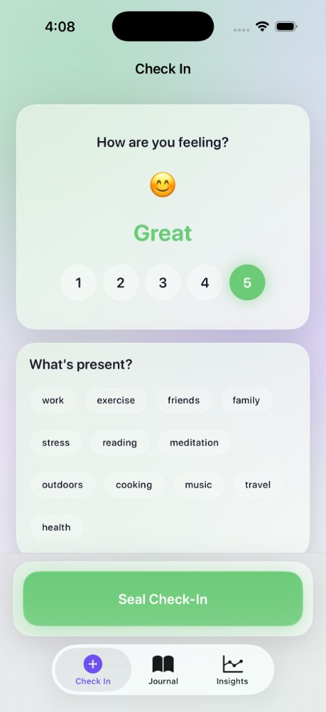
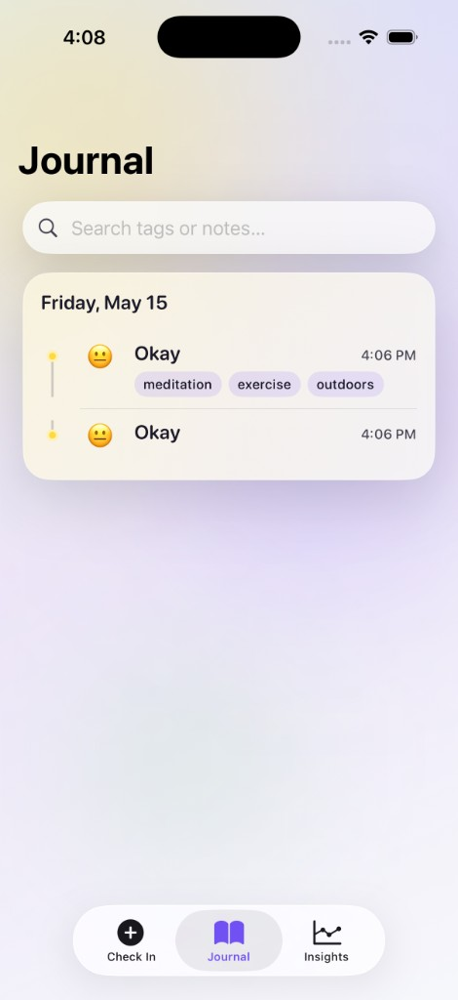
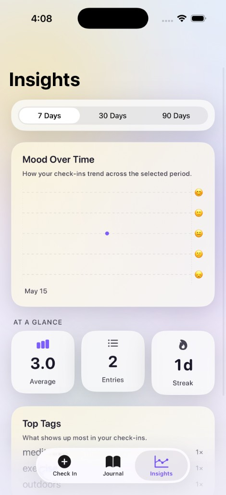

# Reflect

A well-architected iOS mood journal built with SwiftUI, featuring a "Liquid Glass" glassmorphism design, local-first persistence, and full accessibility support.

---

## Features

- **Fast mood check-ins** — Log how you feel in seconds with a 5-point mood scale, tags, and an optional note.
- **Journal timeline** — Browse past entries grouped by day, with quick edit/delete actions.
- **Insights dashboard** — View mood trends over the last 7 / 30 / 90 days with Swift Charts, streak tracking, and top tags.
- **Liquid Glass UI** — Frosted-glass cards, rounded typography, and calm color tokens for a premium, modern feel.
- **Local-first storage** — Entries are stored as JSON on-device via a lightweight persistence layer.
- **First-run onboarding** — Three-page swipeable intro explaining the app, dismissed with a single tap.
- **Accessible by default** — Dynamic Type, VoiceOver labels/hints, minimum tap targets, and screen-reader-friendly charts.
- **Subtle haptics & animation** — Selection, success, and impact feedback; calm entrance animations on cards and charts.

---

## Tech Stack

- **Language:** Swift, SwiftUI
- **Architecture:** MVVM with a shared `MoodStore`
- **Persistence:** JSON file I/O in the app's documents directory (ready to swap to SwiftData / Core Data)
- **Charts:** Swift Charts (line + area)
- **Design System:**
  - Color tokens (`Color.rfAccent`, `Color.rfBackground`, etc.)
  - Typography helpers (`.rf.title`, `.rf.body`, etc.) — all Dynamic Type-enabled
  - Reusable `GlassCard` component using `ultraThinMaterial`
  - `Haptics` helper for tactile feedback
- **Minimum iOS:** 17.0
- **Dependencies:** None (zero SPM / CocoaPods packages)

---

## Architecture

| Layer | Folder | Purpose |
|-------|--------|---------|
| **Model** | `Models/` | `MoodEntry` — Codable value type (id, date, score 1–5, tags, note) |
| **Persistence** | `Services/Persistence/` | `MoodStore` — `@Observable` store, JSON file I/O, CRUD + queries |
| **ViewModels** | `ViewModels/` | One per screen; owns business logic, exposes derived state |
| **Views** | `Views/` | SwiftUI screens — CheckIn, Journal, Insights, Onboarding |
| **Design System** | `DesignSystem/` | Color tokens, typography scale, GlassCard, Haptics |

---

## Project Structure

```text
Reflect/
  ├─ ReflectApp.swift
  ├─ ContentView.swift
  ├─ Models/
  │   └─ MoodEntry.swift
  ├─ ViewModels/
  │   ├─ CheckInViewModel.swift
  │   ├─ JournalViewModel.swift
  │   └─ InsightsViewModel.swift
  ├─ Views/
  │   ├─ CheckIn/CheckInView.swift
  │   ├─ Journal/JournalView.swift
  │   ├─ Insights/InsightsView.swift
  │   └─ Onboarding/OnboardingView.swift
  ├─ Services/
  │   └─ Persistence/MoodStore.swift
  ├─ DesignSystem/
  │   ├─ Colors/ColorTokens.swift
  │   ├─ Typography/Typography.swift
  │   └─ Components/
  │       ├─ GlassCard.swift
  │       └─ Haptics.swift
  └─ Assets.xcassets/
```

---

## Screens

| Screen | Description |
|--------|-------------|
| **Check-In** | 5-point mood selector, tag chips with flow layout, optional note, save with haptic + emoji animation |
| **Journal** | Searchable, day-grouped list with context menus (edit/delete) and encouraging empty state |
| **Insights** | Swift Charts mood trend (animated left-to-right reveal), stat cards, streak counter, top tags |
| **Onboarding** | 3-page full-screen flow explaining mood tracking, app features, and privacy — shown on first launch |

---

## Getting Started

### Prerequisites

- Xcode 16+
- iOS 17+ simulator or device

### Setup

1. Clone the repository:

   ```bash
   git clone https://github.com/aymandakir/reflect.git
   cd reflect
   ```

2. Open the project in Xcode:

   ```bash
   open Reflect.xcodeproj
   ```

3. Build & run on simulator or device (Cmd+R).

---

## Roadmap

- [x] Onboarding flow
- [x] Haptics & entrance animations
- [x] Accessibility (Dynamic Type, VoiceOver)
- [ ] SwiftData migration for richer persistence
- [ ] Supabase sync for cross-device backups
- [ ] Home screen widgets for quick check-ins
- [ ] WatchOS companion app
- [ ] Export data as CSV

---

## Screenshots

<table>
  <tr>
    <th align="center">Check-in</th>
    <th align="center">Journal</th>
    <th align="center">Insights</th>
  </tr>
  <tr>
    <td align="center">
      
    </td>
    <td align="center">
      
    </td>
    <td align="center">
      
    </td>
  </tr>
</table>

---

## License

This project is licensed under the MIT License.
